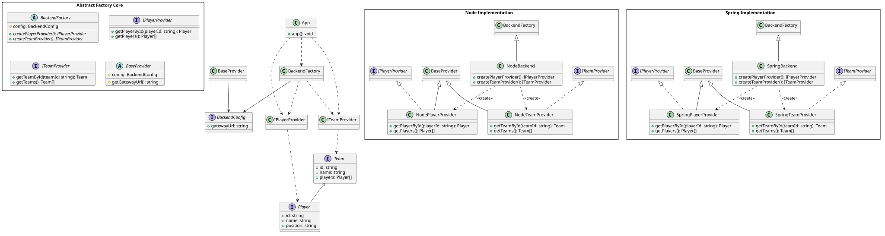
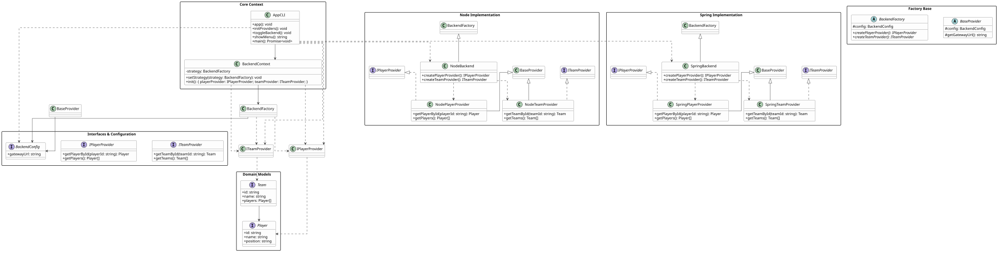

# Toogle Backend — Factory Method & Strategy

Interactive CLI that consumes data from two backends (Node and Spring) using the **Abstract Factory** and **Strategy** patterns. You can toggle between backend implementations at runtime from an interactive menu.

---

## Factory Method (Abstract Factory)

### Problem

We need to create families of related objects (a `Player` provider + a `Team` provider) for different backends, without coupling the client code to concrete classes or instantiation logic.

### Solution

We apply the **Abstract Factory** pattern:

- **`BackendFactory`** — abstract class declaring the factory methods `createPlayerProvider()` and `createTeamProvider()`.
- **`NodeBackend`** — concrete factory that instantiates `NodePlayerProvider` and `NodeTeamProvider`.
- **`SpringBackend`** — concrete factory that instantiates `SpringPlayerProvider` and `SpringTeamProvider`.
- **`BaseProvider`** — abstract base class that receives `BackendConfig` and exposes `gatewayUrl` to all provider implementations.
- The client (`index.factory.ts`) receives a `BackendFactory` instance and consumes the providers without being coupled to concrete implementations. The backend selection is resolved with a static `if/else`.



### Key Code

**`src/creators/backends/BackendFactory.ts`**

```ts
export abstract class BackendFactory {
  constructor(protected config: BackendConfig) {}
  public abstract createPlayerProvider(): IPlayerProvider;
  public abstract createTeamProvider(): ITeamProvider;
}
```

**`src/creators/backends/NodeBackend.ts`**

```ts
export class NodeBackend extends BackendFactory {
  createPlayerProvider(): IPlayerProvider {
    return new NodePlayerProvider(this.config);
  }
  createTeamProvider(): ITeamProvider {
    return new NodeTeamProvider(this.config);
  }
}
```

**`src/index.factory.ts`**

```ts
function app() {
  let playerProvider: IPlayerProvider;
  let teamProvider: ITeamProvider;

  function initialize(factory: BackendFactory) {
    playerProvider = factory.createPlayerProvider();
    teamProvider = factory.createTeamProvider();
  }

  function main() {
    if (backendType === "NODE") {
      initialize(new NodeBackend(config));
    } else if (backendType === "SPRING") {
      initialize(new SpringBackend(config));
    }
    // use playerProvider and teamProvider
  }

  main();
}
```

### Limitation

The backend is selected statically at startup. It cannot be changed without restarting the application. This motivates the evolution to the next pattern.

---

## Strategy + Factory combined

### Problem

We want to switch backends **at runtime** (hot toggle) without losing the decoupling provided by Factory Method. We need to separate strategy selection from object creation logic.

### Solution

We layer the **Strategy** pattern on top of the existing Abstract Factory:

- **`BackendContext`** — the context that holds a reference to the current strategy (`BackendFactory`).
- **`context.setStrategy(factory)`** — swaps the factory at runtime.
- **`context.init()`** — delegates to the current factory to create `playerProvider` and `teamProvider`.
- **Strategy registry** — a `Record<BackendOption, FactoryConstructor>` maps names to factories, eliminating `if/else`.
- **`toggleBackend()`** — alternates between `"NODE"` and `"SPRING"`: calls `setStrategy()` + `initProviders()`.
- The CLI loop lets the user switch backends as many times as they want without restarting.



### Key Code

**`src/context/BackendContext.ts`**

```ts
export class BackendContext {
  constructor(private strategy: BackendFactory) {}

  public setStrategy(strategy: BackendFactory) {
    this.strategy = strategy;
  }

  public init() {
    return {
      playerProvider: this.strategy.createPlayerProvider(),
      teamProvider: this.strategy.createTeamProvider(),
    };
  }
}
```

**`src/index.ts`**

```ts
const backendStrategies: Record<
  BackendOption,
  (c: BackendConfig) => BackendFactory
> = {
  NODE: (c) => new NodeBackend(c),
  SPRING: (c) => new SpringBackend(c),
};

const context = new BackendContext(backendStrategies[currentBackend](config));

function toggleBackend() {
  currentBackend = currentBackend === "NODE" ? "SPRING" : "NODE";
  context.setStrategy(backendStrategies[currentBackend](config));
  initProviders();
}
```

---

## Comparison

| Aspect            | `index.factory.ts` | `index.ts`                   |
| ----------------- | ------------------ | ---------------------------- |
| Pattern           | Abstract Factory   | Strategy + Abstract Factory  |
| Backend selection | Static (`if/else`) | Dynamic (`setStrategy`)      |
| Runtime switching | ❌                 | ✅                           |
| App type          | One-shot script    | Interactive CLI with menu    |
| Provider init     | Once at startup    | Every time you toggle        |
| Factory registry  | Inline `if/else`   | `Record<BackendOption, ...>` |

---

## Project Structure

```
src/
├── context/
│   └── BackendContext.ts           # Strategy context
├── creators/backends/
│   ├── BackendFactory.ts           # Abstract Factory
│   ├── NodeBackend.ts              # Concrete Factory — Node
│   └── SpringBackend.ts            # Concrete Factory — Spring
├── providers/
│   ├── BaseProvider.ts             # Abstract base
│   ├── IPlayerProvider.ts          # Interface
│   ├── ITeamProvider.ts            # Interface
│   ├── NodePlayerProvider.ts       # Node implementation
│   ├── NodeTeamProvider.ts         # Node implementation
│   ├── SpringPlayerProvider.ts     # Spring implementation
│   └── SpringTeamProvider.ts       # Spring implementation
├── models/
│   ├── Player.ts
│   └── Team.ts
├── types/
│   └── BackendConfig.ts
├── mocks/
│   ├── nodePlayers.json
│   ├── nodeTeams.json
│   ├── springPlayers.json
│   └── springTeams.json
├── index.factory.ts                # Entry point: pure Factory Method
└── index.ts                        # Entry point: Strategy + Factory
```

---

## How to Run

### Prerequisites

- [Bun](https://bun.sh) v1.3.14 or later

### Install dependencies

```bash
bun install
```

### Run the Strategy + Factory version (interactive)

```bash
bun run index.ts
```

This starts an interactive CLI menu where you can toggle between the Node and Spring backends at runtime, list players and teams, and fetch individual records by ID.

### Run the pure Factory Method version (one-shot)

```bash
bun run index.factory.ts
```

This runs a non-interactive script that selects a backend via a hardcoded constant, fetches all players and teams, prints them, and exits. The backend type can only be changed by editing the source code.
